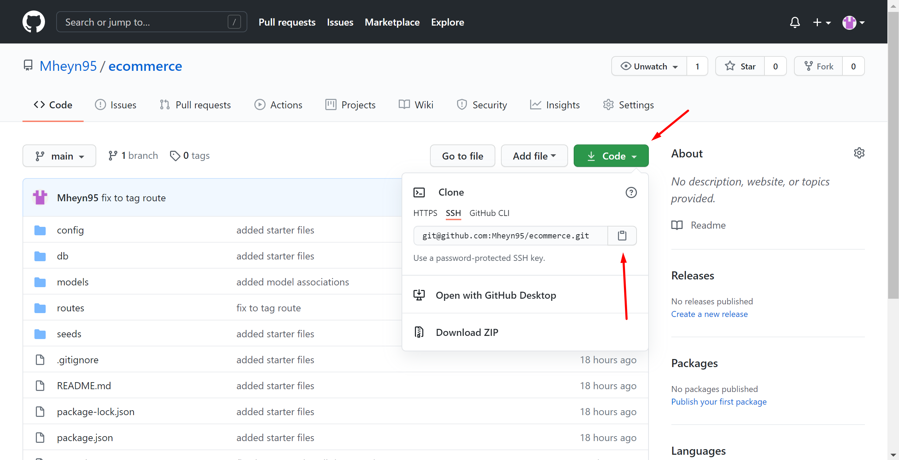
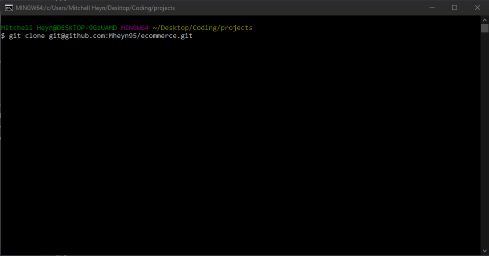
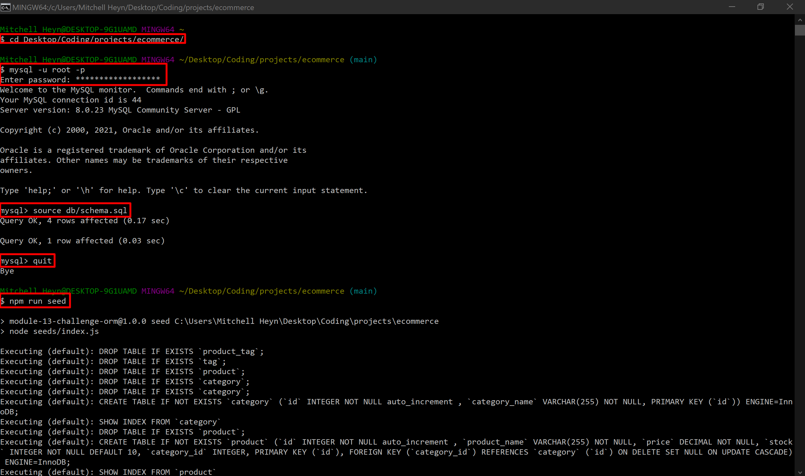
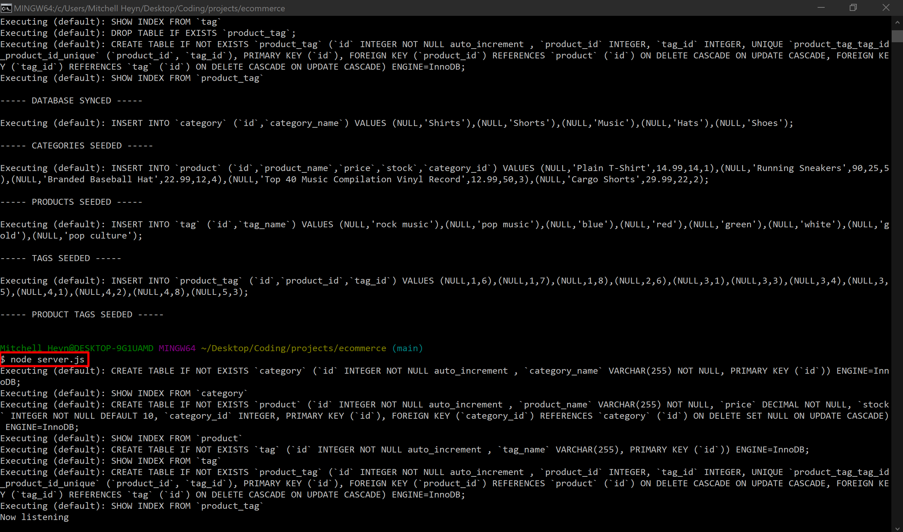

# E-Commerce Back-End

## License

## Description

This application can be used to generate a database for an E-Commerce back end, and interact with it through an API.

## Table of Contents

- [Installation](#installation)
- [Usage](#usage)
- [Questions](#questions)
- [License](#license)
- [Credits](#credits)

## Installation

To install this file navigate to [https://github.com/Mheyn95/ecommerce](https://github.com/Mheyn95/ecommerce) in a web browser and clone the repository.

Here is an image of GitHub and where you can go to clone the repo.

Here is an image of the command you run in terminal to clone the repo onto your own local machine.

## Usage

To use this application go to the directory where you cloned the repository in the terminal. Once here you can login to mysql by typing "mysql -u {username} -p" and then entering your password, then type "source db/schema.sql", which will create the database for the application. You can then quit out of mysql by entering "quit" and enter. Then type, "npm run seed", in the terminal to populate the database with tables and data. Once that completes you can start the server with "node server.js", the application will then run and establish a connection to the database.

Here you can see the different commands to setup and run the application.

To watch a video of how to set up and run this application follow this link:
[Video of E-Commerce Back-End Walkthrough](https://drive.google.com/file/d/1vbK7Jcu7LbFX7Kh5EXWy3lSRh1tMRJwM/view)

## Questions

- GitHub - [https://github.com/Mheyn95](https://github.com/Mheyn95)
- Email - [mheyn95@gmail.com](mailto:mheyn95@gmail.com)

## Contributing

Mitchell Heyn
